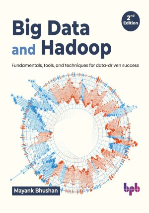

# Big Data and Hadoop - 2nd Edition

This is the repository for [Big Data and Hadoop - 2nd Edition
](https://bpbonline.com/products/big-data-and-hadoop-2nd-edition?variant=43092929544392),published by BPB Publications.

## About the Book
In today's data-driven world, harnessing the power of big data is no longer a luxury, but a necessity. This comprehensive guide, "Big Data and Hadoop," dives deep into the world of big data and equips you with the knowledge and skills you need to conquer even the most complex data landscapes.

Start with the fundamentals of big data, exploring its growing significance and diverse applications. You'll look into the heart of the Apache Hadoop ecosystem, mastering its core components like HDFS and MapReduce. We'll demystify NoSQL databases, introducing you to HBase and Cassandra as powerful alternatives to traditional databases.

Clarify the details of MapReduce programming with practical examples, and discover the power of PigLatin and HiveQL for efficient data analysis. Explore advanced tools like Spark, unlocking its potential for real-time data processing and analytics. Rounding out your knowledge, the book delves into practical applications, exploring real-world scenarios and research-based insights. By the end of this book, you'll emerge as a confident big data explorer, equipped to tackle any data challenge with expertise and precision.

## What You Will Learn
• Gain a solid grasp of the fundamental concepts of big data.

• Acquire a comprehensive understanding of HDFS, MapReduce, YARN, Spark, and related components.

• Learn how to set up and configure Hadoop clusters to create scalable and reliable data processing environments.

• Develop the expertise to design, code, and execute MapReduce jobs to process and analyze vast datasets efficiently.

• Learn how to use Hadoop and related tools to perform advanced data analytics.        
